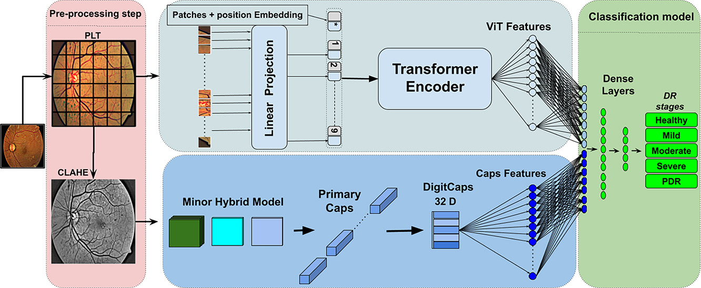

<!-- ===================== BANNER IMAGE ===================== -->
<p align="center">
  
</p>

<h1 align="center">Diabetic Retinopathy Detection using Deep Learning</h1>

<p align="center">
An end-to-end deep learning framework for early detection of Diabetic Retinopathy from retinal fundus images using CNNs and VGG16-based transfer learning.
</p>

---

## Project Motivation

Diabetic Retinopathy (DR) is a leading cause of blindness among diabetic patients.  
Early detection can prevent irreversible vision loss, but manual diagnosis is time-consuming and error-prone.

This project delivers a **robust, scalable, and automated diagnostic system** using **deep learning** to assist medical professionals in early-stage detection.

---

<!-- ===================== FRAMEWORK IMAGE ===================== -->
<p align="center">
  
</p>

---

## System Architecture
Input Retinal Image
↓
Preprocessing (Resize, Normalize)
↓
Channel Expansion (Grayscale → RGB)
↓
VGG16 Pretrained Convolutional Base
↓
Flatten Layer
↓
Dense (512, ReLU)
↓
Dropout
↓
Dense (256, ReLU)
↓
Dropout
↓
Softmax Output (DR / No_DR)


---

## Core Technologies

| Domain | Stack |
|------|------|
| Language | Python |
| Deep Learning | TensorFlow, Keras |
| Transfer Learning | VGG16 |
| Image Processing | OpenCV |
| Visualization | Matplotlib |
| Computation | NumPy |

---

## Key Highlights

- Automated retinal image classification
- Transfer learning for improved accuracy
- Optimized CNN architecture
- Strong generalization on medical data
- Modular and extensible training pipeline
- Ready for real-world deployment

---

## Image Dimensional Understanding

| Representation | Shape |
|---------------|------|
| Single Grayscale Image | (H, W) |
| Dataset of Images | (N, H, W) |
| CNN Input | (N, H, W, 1) |
| VGG16 Input | (N, H, W, 3) |

- **2D** → One grayscale image  
- **3D** → Collection of grayscale images  
- **4D** → Batch input for CNN  

---

## Model Saving & Reuse

```python
model.save("vgg16-own-model.h5")

from tensorflow.keras.models import load_model
model = load_model("vgg16-own-model.h5")
```
## Project Structure
Diabetic-Retinopathy/
│
├── train/
│   ├── DR/
│   └── No_DR/
│
├── test/
│   ├── DR/
│   └── No_DR/
│
├── models/
│   └── vgg16-own-model.h5
│
├── notebooks/
│   └── training_pipeline.ipynb
│
└── README.md

## Future Scope

Multi-class DR severity grading

Fine-tuning deeper VGG layers

Integration with EfficientNet

Grad-CAM explainability

Web-based medical dashboard

Clinical validation pipeline

## Author

Debashish Parida
Computer Science Engineer | Data Science & Medical AI
Focused on production-ready deep learning systems for healthcare.

## Disclaimer

This project is intended strictly for research and educational purposes.
Clinical usage requires regulatory approval and medical validation.
